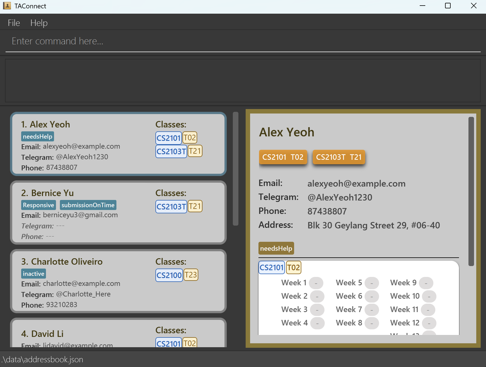

# TAConnect

**TAConnect is a desktop application for managing your contact details.** While it has a GUI, most of the user interactions happen using a CLI (Command Line Interface).

## Quick Start

1. Ensure you have Java `17` or above installed in your Computer. 
   **Mac users:** Ensure you have the precise JDK version prescribed [here](https://se-education.org/guides/tutorials/javaInstallationMac.html).

1. Download the latest `.jar` file from [here](https://github.com/AY2526S2-CS2103T-T10-4/tp/releases).

1. Copy the file to the folder you want to use as the _home folder_ for your TAConnect.

1. Open a command terminal, `cd` into the folder you put the jar file in, and use the `java -jar TAConnect.jar` command to run the application. 
   A GUI similar to the below should appear in a few seconds. Note how the app contains some sample data. 
   

1. Type the command in the command box and press Enter to execute it. e.g. typing **`help`** and pressing Enter will open the help window. 
   Some example commands you can try:

    * `list` : Lists all contacts.

    * `add n/John Doe p/98765432 e/johnd@example.com a/John street, block 123, #01-01 tg/@johndoe` : Adds a contact named `John Doe` to the Address Book.

    * `delete 3` : Deletes the 3rd contact shown in the current list.

    * `view 2` : Displays the full details of the second contact in the current contact list.

    * `clear` : Deletes all contacts.

    * `exit` : Exits the app.

    * `enroll 1 c/CS2103T tut/T01` : Enrolls the first student into CS2103T tutorial group T01.

    * `attend 1 c/CS2103T w/1` : Marks the first student as attended for CS2103T in Week 1.

* For detailed information, head over to our [**documentation**](https://ay2526s2-cs2103t-t10-4.github.io/tp/).

## Acknowledgements

This project is a **part of the se-education.org** initiative. For more information, see the **[Address Book Product Website](https://se-education.org/addressbook-level3)**.

Libraries used: [JavaFX](https://openjfx.io/), [Jackson](https://github.com/FasterXML/jackson), [JUnit5](https://github.com/junit-team/junit5)
