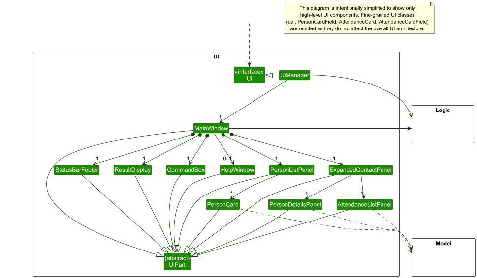
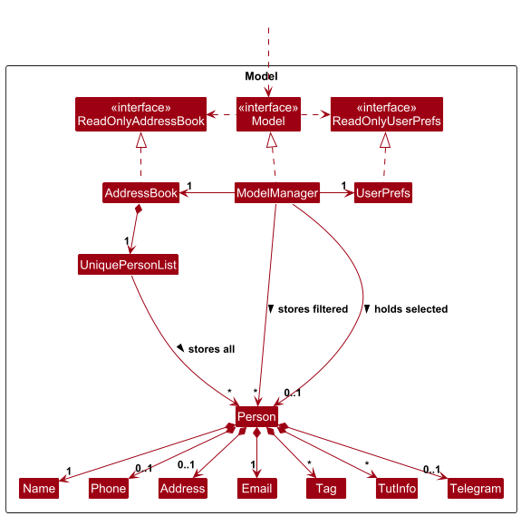

* Table of Contents
{:toc}

--------------------------------------------------------------------------------------------------------------------

## **Acknowledgements**

* {list here sources of all reused/adapted ideas, code, documentation, and third-party libraries -- include links to the original source as well}

--------------------------------------------------------------------------------------------------------------------

## **Setting up, getting started**

Refer to the guide [_Setting up and getting started_](SettingUp.md).

--------------------------------------------------------------------------------------------------------------------

## **Design**

:bulb: **Tip:** The `.puml` files used to create diagrams are in this document `docs/diagrams` folder. Refer to the [_PlantUML Tutorial_ at se-edu/guides](https://se-education.org/guides/tutorials/plantUml.html) to learn how to create and edit diagrams.

### Architecture

The ***Architecture Diagram*** given above explains the high-level design of the App.

Given below is a quick overview of main components and how they interact with each other.

**Main components of the architecture**

**`Main`** (consisting of classes [`Main`](https://github.com/se-edu/addressbook-level3/tree/master/src/main/java/seedu/address/Main.java) and [`MainApp`](https://github.com/se-edu/addressbook-level3/tree/master/src/main/java/seedu/address/MainApp.java)) is in charge of the app launch and shut down.
* At app launch, it initializes the other components in the correct sequence, and connects them up with each other.
* At shut down, it shuts down the other components and invokes cleanup methods where necessary.

The bulk of the app's work is done by the following four components:

* [**`UI`**](#ui-component): The UI of the App.
* [**`Logic`**](#logic-component): The command executor.
* [**`Model`**](#model-component): Holds the data of the App in memory.
* [**`Storage`**](#storage-component): Reads data from, and writes data to, the hard disk.

[**`Commons`**](#common-classes) represents a collection of classes used by multiple other components.

**How the architecture components interact with each other**

The *Sequence Diagram* below shows how the components interact with each other for the scenario where the user issues the command `delete 1`.

Each of the four main components (also shown in the diagram above),

* defines its *API* in an `interface` with the same name as the Component.
* implements its functionality using a concrete `{Component Name}Manager` class (which follows the corresponding API `interface` mentioned in the previous point.

For example, the `Logic` component defines its API in the `Logic.java` interface and implements its functionality using the `LogicManager.java` class which follows the `Logic` interface. Other components interact with a given component through its interface rather than the concrete class (reason: to prevent outside component's being coupled to the implementation of a component), as illustrated in the (partial) class diagram below.

The sections below give more details of each component.

### UI component

The **API** of this component is specified in [`Ui.java`](https://github.com/se-edu/addressbook-level3/tree/master/src/main/java/seedu/address/ui/Ui.java)

The UI consists of a `MainWindow` that is made up of parts e.g.`CommandBox`, `ResultDisplay`, `PersonListPanel`, `StatusBarFooter` etc. All these, including the `MainWindow`, inherit from the abstract `UiPart` class which captures the commonalities between classes that represent parts of the visible GUI.

The `UI` component uses the JavaFx UI framework. The layout of these UI parts are defined in matching `.fxml` files that are in the `src/main/resources/view` folder. For example, the layout of the [`MainWindow`](https://github.com/se-edu/addressbook-level3/tree/master/src/main/java/seedu/address/ui/MainWindow.java) is specified in [`MainWindow.fxml`](https://github.com/se-edu/addressbook-level3/tree/master/src/main/resources/view/MainWindow.fxml)

The `UI` component,

* executes user commands using the `Logic` component.
* listens for changes to `Model` data so that the UI can be updated with the modified data.
* keeps a reference to the `Logic` component, because the `UI` relies on the `Logic` to execute commands.
* depends on some classes in the `Model` component, as it displays `Person` object residing in the `Model`.

### Logic component

**API** : [`Logic.java`](https://github.com/se-edu/addressbook-level3/tree/master/src/main/java/seedu/address/logic/Logic.java)

Here's a (partial) class diagram of the `Logic` component:

The sequence diagram below illustrates the interactions within the `Logic` component, taking `execute("delete 1")` API call as an example.

:information_source: **Note:** The lifeline for `DeleteCommandParser` should end at the destroy marker (X) but due to a limitation of PlantUML, the lifeline continues till the end of diagram.

How the `Logic` component works:

1. When `Logic` is called upon to execute a command, it is passed to an `AddressBookParser` object which in turn creates a parser that matches the command (e.g., `DeleteCommandParser`) and uses it to parse the command.
1. This results in a `Command` object (more precisely, an object of one of its subclasses e.g., `DeleteCommand`) which is executed by the `LogicManager`.
1. The command can communicate with the `Model` when it is executed (e.g. to delete a person). 
   Note that although this is shown as a single step in the diagram above (for simplicity), in the code it can take several interactions (between the command object and the `Model`) to achieve.
1. The result of the command execution is encapsulated as a `CommandResult` object which is returned back from `Logic`.

Here are the other classes in `Logic` (omitted from the class diagram above) that are used for parsing a user command:

How the parsing works:
* When called upon to parse a user command, the `AddressBookParser` class creates an `XYZCommandParser` (`XYZ` is a placeholder for the specific command name e.g., `AddCommandParser`) which uses the other classes shown above to parse the user command and create a `XYZCommand` object (e.g., `AddCommand`) which the `AddressBookParser` returns back as a `Command` object.
* All `XYZCommandParser` classes (e.g., `AddCommandParser`, `DeleteCommandParser`, ...) inherit from the `Parser` interface so that they can be treated similarly where possible e.g, during testing.

### Model component
**API** : [`Model.java`](https://github.com/se-edu/addressbook-level3/tree/master/src/main/java/seedu/address/model/Model.java)

The `Model` component,

* stores the address book data i.e., all `Person` objects (which are contained in a `UniquePersonList` object).
* stores the currently 'selected' `Person` objects (e.g., results of a search query) as a separate _filtered_ list which is exposed to outsiders as an unmodifiable `ObservableList<Person>` that can be 'observed' e.g. the UI can be bound to this list so that the UI automatically updates when the data in the list change.
* stores a `UserPref` object that represents the user’s preferences. This is exposed to the outside as a `ReadOnlyUserPref` objects.
* does not depend on any of the other three components (as the `Model` represents data entities of the domain, they should make sense on their own without depending on other components)

:information_source: **Note:** An alternative (arguably, a more OOP) model is given below. It has a `Tag` list in the `AddressBook`, which `Person` references. This allows `AddressBook` to only require one `Tag` object per unique tag, instead of each `Person` needing their own `Tag` objects. 

### Storage component

**API** : [`Storage.java`](https://github.com/se-edu/addressbook-level3/tree/master/src/main/java/seedu/address/storage/Storage.java)

The `Storage` component,
* can save both address book data and user preference data in JSON format, and read them back into corresponding objects.
* inherits from both `AddressBookStorage` and `UserPrefStorage`, which means it can be treated as either one (if only the functionality of only one is needed).
* depends on some classes in the `Model` component (because the `Storage` component's job is to save/retrieve objects that belong to the `Model`)

### Common classes

Classes used by multiple components are in the `seedu.address.commons` package.

--------------------------------------------------------------------------------------------------------------------

## **Implementation**

This section describes some noteworthy details on how certain features are implemented.

TODO: Add the implementations of some of our features here

--------------------------------------------------------------------------------------------------------------------

## **Documentation, logging, testing, configuration, dev-ops**

* [Documentation guide](Documentation.md)
* [Testing guide](Testing.md)
* [Logging guide](Logging.md)
* [Configuration guide](Configuration.md)
* [DevOps guide](DevOps.md)

--------------------------------------------------------------------------------------------------------------------

## **Appendix: Requirements**

### Product scope

**Target user profile**:

* is a NUS computer science teaching assistant managing multiple tutorial classes
* needs to organize and track contacts across distinct academic roles (students, professors, fellow TAs, course admins)
* requires the ability to categorize and quickly retrieve contacts using specific fields (e.g., by tutorial group)
* frequently handles incomplete contact profiles that need to be updated iteratively (e.g., adding Telegram handles later)
* needs a reliable way to archive and export contact data at the end of the academic semester (e.g., a JSON file)
* prefers a streamlined, role-specific tool over a general-purpose address book
* can type fast
* prefers desktop apps over other types
* prefers typing to mouse interactions
* is reasonably comfortable using CLI apps

**Value proposition**: 
This product aims to streamline communication from TA’s to their students, other TA’s, teaching staff, professors, and course admins. It achieves this by organizing contacts into courses, tutorial groups and tags. It supports custom contact categories (e.g. Telegram handles), and more searching functionality (e.g. by groups and/or by email etc.). It also makes contacts storing more flexible by only making names mandatory. 

### User stories

Priorities: High (must have) - `* * *`, Medium (nice to have) - `* *`, Low (unlikely to have) - `*`

| Priority | As a …​ | I want to …​                                                       | So that I can…​                                            |
|----------|---------|--------------------------------------------------------------------|------------------------------------------------------------|
| `* * *`  | TA      | add a contact to the address book                                  | keep a record of a person.                                 |
| `* * *`  | TA      | delete a contact from the app                                      | remove unwanted entries and keep my contact list accurate. |
| `* * *`  | TA      | view all contacts from the app                                     | see all entries in the contact list.                       |
| `* *`    | TA      | find some contacts from the app by one or more specific attributes | see some special type of contacts in the contact list.     |
| `*`      | TA      | enroll a students to a course and a tutorial group                 | distinguish my students from different course              |
| `*`      | TA      | mark a tutrial session from a course of a student as attend        | identify if a student need help                            |
### Use cases

(For all use cases below, the **System** is `TAConnect` and the **Actor** is `NUS Computer Science Teaching Assistant (NUS CS TA)` unless specified otherwise)

<ins>**Use case: UC01 - View All Contacts**</ins>

**Guarantees:** All the contacts in the address book are displayed in the contact list.

**MSS**

1. TA requests to view their list of all contacts.
2. TAConnect lists all contacts and displays a success message.

    Use case ends.

**Extensions**

* 2a. No contacts exist.

    * 2a1. TAConnect displays an empty state message.

      Use case ends.

<ins>**Use case: UC02 - Add A Contact**</ins>

**Guarantees:** A new contact is stored in the address book only if the input is valid.

**MSS**

1. TA requests to add a contact with a name and any optional details (phone number, email, address, Telegram handle, tags).
2. TAConnect validates the input.
3. TAConnect adds the contact, displays a success message, and shows the updated contact list with the new contact's details.
   
   Use case ends.

**Extensions**

* 2a. TAConnect detects invalid input.

    * 2a1. TAConnect informs TA of invalid input and displays the correct format with an example.

      Use case ends.

<ins>**Use case: UC03 - Delete A Contact**</ins>

**Preconditions:** TA has at least one contact in their list.

**Guarantees:** The chosen contact is removed from the address book only if the contact index is valid.

**MSS**

1. TA requests to delete a specific contact.
2. TAConnect deletes the contact, displays a success message, and shows the updated contact list.

   Use case ends.

**Extensions**

* 1a. TAConnect detects an invalid or out-of-range contact index.

    * 1a1. TAConnect informs TA of the invalid index and displays the correct format with an example.

      Use case ends.

* 1b. TAConnect detects other invalid input.

    * 1b1. TAConnect informs TA of the invalid input and displays the correct format with an example.

      Use case ends.

<ins>**Use case: UC04 - Edit A Contact**</ins>

**Preconditions:** TA has at least one contact in their list.

**Guarantees:** The contact's details are updated only if the input and contact index are valid.

**MSS**

1. TA requests to edit specific field(s) of a specific contact with new value(s).
2. TAConnect validates the new value(s) for the specified field(s).
3. TAConnect updates the contact, displays a success message, and shows the updated contact list.

   Use case ends.

**Extensions**

* 1a. TAConnect detects an invalid or out-of-range contact index.

    * 1a1. TAConnect informs TA of the invalid index and displays the correct format with an example.

      Use case ends.

* 1b. TAConnect detects other invalid input (e.g. no fields provided, invalid field values).

    * 1b1. TAConnect informs TA of the invalid input and displays the correct format with an example.

      Use case ends.

<ins>**Use case: UC05 - Search/Filter Contacts**<ins>

**Preconditions:** TA has at least one contact in their list.

**Guarantees:** Contacts matching the search criteria are displayed only if the input is valid.

**MSS**

1. TA enters a search query with a valid combination of filter criteria (e.g. name, course, tutorial group, tag).
2. TAConnect retrieves the relevant contacts, displays a success message, and shows the filtered contact list.

   Use case ends.

**Extensions**

* 1a. TA specifies a tutorial group without a course code.

    * 1a1. TAConnect informs TA that a course code is required when filtering by tutorial group.

      Use case ends.

* 1b. TAConnect detects other invalid input.

    * 1b1. TAConnect informs TA of the invalid input and displays the correct format with an example.

      Use case ends.

* 2a. No contacts match the given criteria.

    * 2a1. TAConnect informs TA that no matching contacts were found.

      Use case ends.

<ins>**Use case: UC06 - View A Contact**<ins>

**Preconditions:** TA has at least one contact in their list.

**Guarantees:** The full details of the specified contact are displayed only if the contact index is valid.

**MSS**

1. TA requests to view the full details of a specific contact.
2. TAConnect displays the full details of the contact.

   Use case ends.

**Extensions**

* 1a. TAConnect detects an invalid or out-of-range contact index.

    * 1a1. TAConnect informs TA of the invalid index and displays the correct format with an example.

      Use case ends.

* 1b. TAConnect detects other invalid input.

    * 1b1. TAConnect informs TA of the invalid input and displays the correct format with an example.

      Use case ends.

<ins>**Use case: UC07 - Enroll A Student**<ins>

**Preconditions:** TA has at least one contact in their list.

**Guarantees:** The specified student is enrolled in the given course and tutorial group only if the input is valid.

**MSS**

1. TA requests to enroll a specific contact into a course and tutorial group.
2. TAConnect validates the input.
3. TAConnect enrolls the student into the course and tutorial group, displays a success message, and shows the updated contact details.

   Use case ends.

**Extensions**

* 1a. TAConnect detects an invalid or out-of-range contact index.

    * 1a1. TAConnect informs TA of the invalid index and displays the correct format with an example.

      Use case ends.

* 1b. TAConnect detects other invalid input (e.g. missing course code or tutorial group).

    * 1b1. TAConnect informs TA of the invalid input and displays the correct format with an example.

      Use case ends.

* 2a. Student is already enrolled in the given course and tutorial group.

    * 2a1. TAConnect informs TA that the student is already enrolled.

      Use case ends.

<ins>**Use case: UC08 - Unenroll A Student**<ins>

**Preconditions:** TA has at least one contact in their list.

**Guarantees:** The specified student is unenrolled from the given course only if the input is valid.

**MSS**

1. TA requests to unenroll a specific contact from a course.
2. TAConnect validates the input.
3. TAConnect unenrolls the student from the course, displays a success message, and shows the updated contact details.

   Use case ends.

**Extensions**

* 1a. TAConnect detects an invalid or out-of-range contact index.

    * 1a1. TAConnect informs TA of the invalid index and displays the correct format with an example.

      Use case ends.

* 1b. TAConnect detects other invalid input (e.g. missing course code, or unnecessarily provided tutorial group).

    * 1b1. TAConnect informs TA of the invalid input and displays the correct format with an example.

      Use case ends.

* 2a. Student is not enrolled in the given course.

    * 2a1. TAConnect informs TA that the student is not enrolled in the given course.

      Use case ends.

<ins>**Use case: UC09 - Mark Attendance**<ins>

**Preconditions:** TA has at least one contact in their list.

**Guarantees:** The specified student's attendance is marked for the given course and week only if the input is valid.

**MSS**

1. TA requests to mark attendance for a specific contact for a given course and week.
2. TAConnect validates the input.
3. TAConnect marks the attendance, displays a success message, and shows the updated contact details.

   Use case ends.

**Extensions**

* 1a. TAConnect detects an invalid or out-of-range contact index.

    * 1a1. TAConnect informs TA of the invalid index and displays the correct format with an example.

      Use case ends.

* 1b. TAConnect detects other invalid input (e.g. missing course code, missing week number, week number out of range 1-13, unnecessarily provided tutorial group).

    * 1b1. TAConnect informs TA of the invalid input and displays the correct format with an example.

      Use case ends.

* 2a. Student is not enrolled in the given course.

    * 2a1. TAConnect informs TA that the student is not enrolled in the given course.

      Use case ends.

<ins>**Use case: UC10 - Unmark Attendance**<ins>

**Preconditions:** TA has at least one contact in their list.

**Guarantees:** The specified student's attendance is unmarked for the given course and week only if the input is valid.

**MSS**

1. TA requests to unmark attendance for a specific contact for a given course and week.
2. TAConnect validates the input.
3. TAConnect unmarks the attendance, displays a success message, and shows the updated contact details.

   Use case ends.

**Extensions**

* 1a. TAConnect detects an invalid or out-of-range contact index.

    * 1a1. TAConnect informs TA of the invalid index and displays the correct format with an example.

      Use case ends.

* 1b. TAConnect detects other invalid input (e.g. missing course code, missing week number, week number out of range 1-13, unnecessarily provided tutorial group).

    * 1b1. TAConnect informs TA of the invalid input and displays the correct format with an example.

      Use case ends.

* 2a. Student is not enrolled in the given course.

    * 2a1. TAConnect informs TA that the student is not enrolled in the given course.

      Use case ends.

### Non-Functional Requirements

1. All commands should have a response within 500ms.
2. All contact information should be stored locally.
3. Whenever a typo or mistake is made there is a message instead of a crash.
4. The software should be able to host at least 100 students in total.
5. The software should take no more than 200MB of space.
6. Exported files for backup should be stored in a user-editable format (e.g., a JSON file).
7. The software should be platform-independent, supporting all Windows, macOS and Linux.
8. The software should not require any installers and should be able to be packaged into a single JAR file.
9. The software should not depend on any remote server.
10. GUI should provide visual feedback, but input is primarily text-based.
11. The software should be able to handle corrupted and missing files.
12. The software should be single-user based only.

### Glossary

* **Teaching Assistant (TA)**: A member of the teaching team who supports a course by running tutorials/labs, facilitating discussions, answering student questions, and coordinating with professors, course admins, and other TAs.
* **Tag**: A user-defined label attached to a contact to classify and organize them (e.g., student, prof, cs2103, tut01, projectgrpA). Tags enable quick filtering and searching across the contact list.
* **Course**: A structured module offered by the university with a unique course code (e.g. CS2101).
* **Tutorial/Lab Group**: A specific class grouping of students with a tutorial/lab code (e.g. Tut10, Lab11) of a course assigned to a TA.
* **Course Admin**: A staff member responsible for the administrative and operational aspects of a course (e.g., scheduling, enrollment matters, logistics, announcements, and handling exceptional cases).
* **Student**: A NUS Computer Science enrolled in a course supported by the TA.

--------------------------------------------------------------------------------------------------------------------

## **Appendix: Instructions for manual testing**

Given below are instructions to test the app manually.

:information_source: **Note:** These instructions only provide a starting point for testers to work on;
testers are expected to do more *exploratory* testing.

### Launch and shutdown

1. Initial launch

   1. Download the jar file and copy into an empty folder

   1. Double-click the jar file Expected: Shows the GUI with a set of sample contacts. The window size may not be optimum.

1. Saving window preferences

   1. Resize the window to an optimum size. Move the window to a different location. Close the window.

   1. Re-launch the app by double-clicking the jar file. 
       Expected: The most recent window size and location is retained.

1. _{ more test cases …​ }_

### Deleting a person

1. Deleting a person while all persons are being shown

   1. Prerequisites: List all persons using the `list` command. Multiple persons in the list.

   1. Test case: `delete 1` 
      Expected: First contact is deleted from the list. Details of the deleted contact shown in the status message. Timestamp in the status bar is updated.

   1. Test case: `delete 0` 
      Expected: No person is deleted. Error details shown in the status message. Status bar remains the same.

   1. Other incorrect delete commands to try: `delete`, `delete x`, `...` (where x is larger than the list size) 
      Expected: Similar to previous.

1. _{ more test cases …​ }_

### Saving data

1. Dealing with missing/corrupted data files

   1. _{explain how to simulate a missing/corrupted file, and the expected behavior}_

1. _{ more test cases …​ }_
