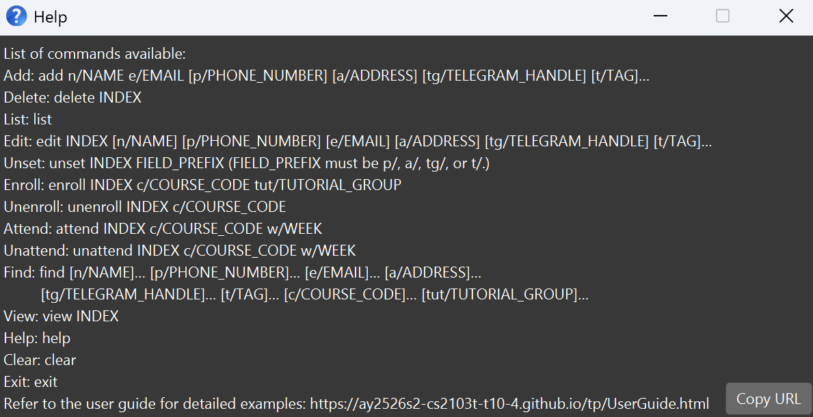
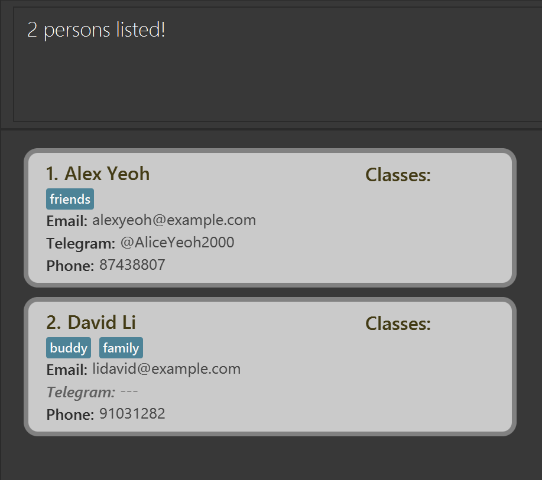

**TAConnect** is a **desktop app for managing contacts, optimized for use via a Command Line Interface (CLI)** while still providing the benefits of a Graphical User Interface (GUI). It helps users quickly organize contacts into tutorial groups, tags, and custom fields (e.g., Telegram handles), with only names being mandatory. Fast CLI commands allow adding, viewing, editing, and searching contacts efficiently, while the GUI displays full details and organized lists.

**Target Users:** NUS Computer Science TAs

**Assumptions:** Users have basic computer literacy and are familiar with command-line operations.

* Table of Contents
{:toc}

--------------------------------------------------------------------------------------------------------------------

## Quick start

1. Ensure you have Java `17` or above installed in your Computer. 
   **Mac users:** Ensure you have the precise JDK version prescribed [here](https://se-education.org/guides/tutorials/javaInstallationMac.html).

1. Download the latest `.jar` file from [here](https://github.com/AY2526S2-CS2103T-T10-4/tp/releases).

1. Copy the file to the folder you want to use as the _home folder_ for your TAConnect.

1. Open a command terminal, `cd` into the folder you put the jar file in, and use the `java -jar TAConnect.jar` command to run the application.

1. Type the command in the command box and press Enter to execute it. e.g. typing **`help`** and pressing Enter will open the help window. 
   Some example commands you can try:

   * `list` : Lists all contacts.

   * `add n/John Doe p/98765432 e/johnd@example.com a/John street, block 123, #01-01 tg/@johndoe` : Adds a contact named `John Doe` to the Address Book.

   * `delete 3` : Deletes the 3rd contact shown in the current list.

   * `view 2` : Displays the full details of the second contact in the current contact list.

   * `clear` : Deletes all contacts.

   * `exit` : Exits the app.

   * `enroll 1 c/CS2103T tut/T01` : Enrolls the first student into CS2103T tutorial group T01.

   * `attend 1 c/CS2103T w/1` : Marks the first student as attended for CS2103T in Week 1.

1. Refer to the [Features](#features) below for details of each command.

--------------------------------------------------------------------------------------------------------------------

## Features

**:information_source: Notes about the command format:** 

* Words in `UPPER_CASE` are the parameters to be supplied by the user. 
  e.g. in `add n/NAME`, `NAME` is a parameter which can be used as `add n/John Doe`.

* Items in square brackets are optional. 
  e.g `n/NAME [t/TAG]` can be used as `n/John Doe t/friend` or as `n/John Doe`.

* Items with `…`​ after them can be used multiple times including zero times. 
  e.g. `[t/TAG]…​` can be used as ` ` (i.e. 0 times), `t/friend`, `t/friend t/family` etc.

* Parameters can be in any order. 
  e.g. if the command specifies `n/NAME p/PHONE_NUMBER`, `p/PHONE_NUMBER n/NAME` is also acceptable.

* Extraneous parameters for commands that do not take in parameters (such as `help`, `list`, `exit` and `clear`) will be ignored. 
  e.g. if the command specifies `help 123`, it will be interpreted as `help`.

* If you are using a PDF version of this document, be careful when copying and pasting commands that span multiple lines as space characters surrounding line-breaks may be omitted when copied over to the application.

### Viewing help : `help`

Shows a message explaining how to access the help page.

Format: `help`

### Adding a person: `add`

Adds a person to the address book.

Format: `add n/NAME [p/PHONE_NUMBER] [e/EMAIL] [a/ADDRESS] [tg/TELEGRAM_HANDLE] [t/TAG]…​`

:bulb: **Tip:**
A person can have any number of tags (including 0)

Examples:
* `add n/John Doe e/johnd@example.com a/John street, block 123, #01-01`
* `add n/Alex Yeoh`
* `add n/Betsy Crowe t/friend e/betsycrowe@example.com a/Newgate Prison p/1234567 tg/@betsycrowe t/criminal`
* `add n/David Li tg/davidli`

### Listing all persons : `list`

Shows a list of all persons in the address book.

Format: `list`

### Editing a person : `edit`

Edits an existing person in the address book.

Format: `edit INDEX [n/NAME] [p/PHONE_Number] [e/EMAIL] [a/ADDRESS] [tg/TELEGRAM_HANDLE][t/TAG]…​`

* Edits the person at the specified `INDEX`. The index refers to the index number shown in the displayed person list. The index **must be a positive integer** 1, 2, 3, …​
* At least one of the optional fields must be provided.
* Existing values will be updated to the input values.
* When editing tags, the existing tags of the person will be removed i.e adding of tags is not cumulative.
* You can remove all the person’s tags by typing `t/` without
    specifying any tags after it.

Examples:
*  `edit 1 p/91234567 e/johndoe@example.com` Edits the phone number and email address of the 1st person to be `91234567` and `johndoe@example.com` respectively.
*  `edit 2 n/Betsy Crower t/` Edits the name of the 2nd person to be `Betsy Crower` and clears all existing tags.

### Enrolling a person : `enroll`

Enrolls a student into a specific course and tutorial group.

Format: `enroll INDEX c/COURSE_CODE tut/TUTORIAL_GROUP`

* Enrolls the student at the specified `INDEX` into the `COURSE_CODE` and `TUTORIAL_GROUP`.
* The index refers to the index number shown in the displayed person list.
* The index **must be a positive integer** (e.g., 1, 2, 3, …).

Examples:
* `enroll 1 c/CS2103T tut/T01` enrolls the 1st student into CS2103T tutorial group T01.

### Unenrolling a person : `unenroll`

Unenrolls a student from a specific course.

Format: `unenroll INDEX c/COURSE_CODE`

* Unenrolls the student at the specified `INDEX` from the `COURSE_CODE`.
* The index refers to the index number shown in the displayed person list.
* The index **must be a positive integer** (e.g., 1, 2, 3, …).

Examples:
* `unenroll 1 c/CS2103T` unenrolls the 1st student from CS2103T.

### Marking attendance : `attend`

Marks a student's attendance for a specific course and week.

Format: `attend INDEX c/COURSE_CODE w/WEEK`

* Marks the attendance for the student at the specified `INDEX`.
* The index refers to the index number shown in the displayed person list.
* The index **must be a positive integer** (e.g., 1, 2, 3, …).
* `COURSE_CODE` must be a course the student is currently enrolled in.
* `WEEK` must be a number from 1 to 13 (inclusive).

Examples:
* `attend 1 c/CS2103T w/1` marks the attendance of the 1st student for CS2103T in Week 1.
* `attend 2 c/CS2101 w/10` marks the attendance of the 2nd student for CS2101 in Week 10.

### Unmarking attendance : `unattend`

Unmarks a student's attendance for a specific course and week.

Format: `unattend INDEX c/COURSE_CODE w/WEEK`

* Unmarks the attendance for the student at the specified `INDEX`.
* The index refers to the index number shown in the displayed person list.
* The index **must be a positive integer** (e.g., 1, 2, 3, …).
* `COURSE_CODE` must be a course the student is currently enrolled in.
* `WEEK` must be a number from 1 to 13 (inclusive).

Examples:
* `unattend 1 c/CS2103T w/1` unmarks the attendance of the 1st student for CS2103T in Week 1.

### Locating persons by name: `find`

Finds persons whose attributes matches any of the given keywords on every field specified in the command flags.

Format: `find [n/NAME]… [p/PHONE_NUMBER]… [e/EMAIL]… [a/ADDRESS]… [tg/TELEGRAM_HANDLE]… [t/TAG]… [c/COURSE_CODE]… [tut/TUTORIAL_GROUP]…`

* Multiple fields can be specified here, persons matching all the predicates will be returned (i.e. `AND` search).
* The search is case-insensitive. e.g `n/hans` will match `Hans`
* The order of the flags does not matter. e.g. `find n/Alex c/CS2103T` 
will have the same effect as `find c/CS2103T n/Alex`
* Partial matching is supported for longer fields (i.e. Name, Phone number, Email, Address, and Telegram handle).
e.g. `n/Han` will match `Hans`
* Exact matching is used for shorter fields (i.e. Tag, Course code, and Tutorial group). 
e.g. `c/CS210` won't match `CS2103T`
* To search by tutorial group, you must also provide a course code (e.g., `c/CS2103T tut/T01`). 
Which means commands like `find tut/T01` won't work.

Examples:
* `find n/John` returns `john` and `John Doe`
* `find n/alex n/david` returns `Alex Yeoh`, `David Li`
* `find c/CS2103T tut/T01` returns all students in CS2103T tutorial group T01.
* `find p/807 e/alex` returns all students with `807` in their phone number and has `alex` in their email address.

  

### Deleting a person : `delete`

Deletes the specified person from the address book.

Format: `delete INDEX`

* Deletes the person at the specified `INDEX`.
* The index refers to the index number shown in the displayed person list.
* The index **must be a positive integer** 1, 2, 3, …​

Examples:
* `list` followed by `delete 2` deletes the 2nd person in the address book.
* `find Betsy` followed by `delete 1` deletes the 1st person in the results of the `find` command.

### Viewing a contact : `view`

Displays full details of a contact in TAConnect.

Format: `view INDEX`

* Views **all available information** of the contact at the specified `INDEX`.
* `INDEX` refers to the position of the contact in the currently displayed list.
* The index **must be a positive integer** (1, 2, 3, …​) corresponding to an existing contact.
* Does **not** modify any data with only display updates.

Examples:
* `view 3` Shows full details of the third contact in the current filtered list.

### Clearing all entries : `clear`

Clears all entries from the address book.

Format: `clear`

### Exiting the program : `exit`

Exits the program.

Format: `exit`

### Saving the data

TAConnect data are saved in the hard disk automatically after any command that changes the data. There is no need to save manually.

### Editing the data file

TAConnect data are saved automatically as a JSON file `[JAR file location]/data/addressbook.json`. Advanced users are welcome to update data directly by editing that data file.

:exclamation: **Caution:**
If your changes to the data file makes its format invalid, TAConnect will discard all data and start with an empty data file at the next run. Hence, it is recommended to take a backup of the file before editing it. 
Furthermore, certain edits can cause the TAConnect to behave in unexpected ways (e.g., if a value entered is outside of the acceptable range). Therefore, edit the data file only if you are confident that you can update it correctly.

### Archiving data files `[coming in v2.0]`

_Details coming soon ..._

--------------------------------------------------------------------------------------------------------------------

## FAQ

**Q**: How do I transfer my data to another Computer? 
**A**: Install the app in the other computer and overwrite the empty data file it creates with the file that contains the data of your previous TAConnect home folder.

--------------------------------------------------------------------------------------------------------------------

## Known issues

1. **When using multiple screens**, if you move the application to a secondary screen, and later switch to using only the primary screen, the GUI will open off-screen. The remedy is to delete the `preferences.json` file created by the application before running the application again.
2. **If you minimize the Help Window** and then run the `help` command (or use the `Help` menu, or the keyboard shortcut `F1`) again, the original Help Window will remain minimized, and no new Help Window will appear. The remedy is to manually restore the minimized Help Window.

--------------------------------------------------------------------------------------------------------------------

## Command summary

Action | Format, Examples
--------|------------------
**Add** | `add n/NAME [p/PHONE_NUMBER] [tg/TELEGRAM] t[e/EMAIL] [a/ADDRESS] [t/TAG]…​`   e.g., `add n/James Ho p/22224444 tg/JamesHo0318 e/jamesho@example.com a/123, Clementi Rd, 1234665 t/friend t/colleague`
**Clear** | `clear`
**Delete** | `delete INDEX`  e.g., `delete 3`
**Edit** | `edit INDEX [n/NAME] [p/PHONE_NUMBER] [e/EMAIL] [a/ADDRESS] [t/TAG]…​`  e.g.,`edit 2 n/James Lee e/jameslee@example.com`
**Find** | `find [n/NAME] [p/PHONE_NUMBER] [e/EMAIL] [a/ADDRESS] [tg/TELEGRAM_HANDLE] [t/TAG] [c/COURSE_CODE] [tut/TUTORIAL_GROUP]`   e.g., `find p/807 e/alex`
**View** | `view INDEX`  e.g., `view 1`
**List** | `list`
**Help** | `help`
**Enroll** | `enroll INDEX c/COURSE_CODE tut/TUTORIAL_GROUP`   e.g., `enroll 1 c/CS2103T tut/T01`
**Unenroll** | `unenroll INDEX c/COURSE_CODE`   e.g., `unenroll 1 c/CS2103T`
**Attend** | `attend INDEX c/COURSE_CODE w/WEEK`   e.g., `attend 1 c/CS2103T w/1`
**Unattend** | `unattend INDEX c/COURSE_CODE w/WEEK`   e.g., `unattend 1 c/CS2103T w/1`
**Exit** | `exit`
